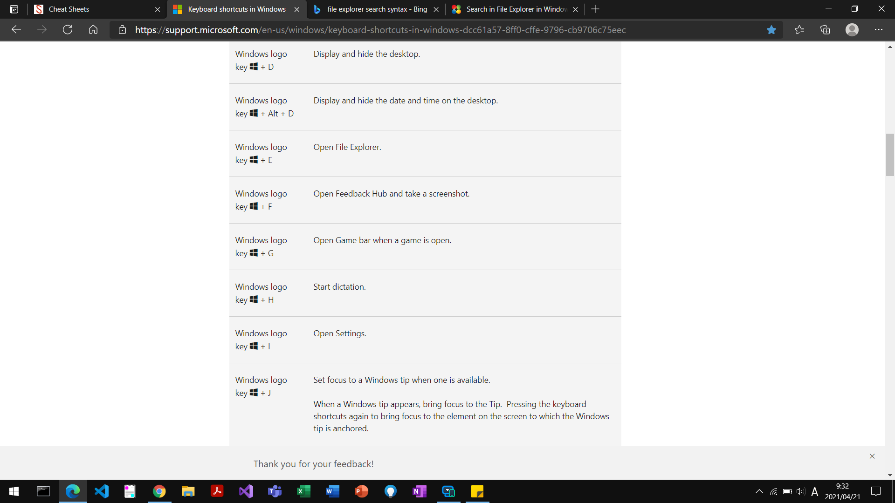

# Markdown Basic Syntax

These are the elements outlined in John Gruber’s original design document.
All Markdown applications support these elements.

## Table Of Contents

- [Markdown Basic Syntax](#markdown-basic-syntax)
  - [Table Of Contents](#table-of-contents)
  - [4.1 Thematic breaks](#41-thematic-breaks)
  - [4.2 ATX headings](#42-atx-headings)
    - [h3](#h3)
      - [h4](#h4)
  - [4.4 Indented code blocks](#44-indented-code-blocks)
  - [4.5 Fenced code blocks](#45-fenced-code-blocks)
  - [5.1 Block quotes](#51-block-quotes)
  - [5.2 List items](#52-list-items)
  - [6.1 Code spans](#61-code-spans)
  - [6.2 Emphasis and strong emphasis](#62-emphasis-and-strong-emphasis)
  - [6.3 Links](#63-links)
  - [6.4 Images](#64-images)

## 4.1 Thematic breaks

---

## 4.2 ATX headings

### h3

#### h4

## 4.4 Indented code blocks

    a simple
    indented code block

## 4.5 Fenced code blocks

TEXT

```text
手順15.5.2. で意図しないエラーが発生したため。  
error error error error error error
```

JSON

```json
{
  "limit": "3:00"
}
```

## 5.1 Block quotes

> blockquote

## 5.2 List items

- 1.0:
  - 作成日時:
  - 更新内容: 初版作成

1. First item
2. Second item
3. Third item

## 6.1 Code spans

コード(`123456789012`)

## 6.2 Emphasis and strong emphasis

**太字**です。

This is *emphasis:italicized text*.

## 6.3 Links

[SIEM on Amazon ESの公式ドキュメント](https://github.com/aws-samples/siem-on-amazon-elasticsearch-service/blob/main/README_ja.md#%E4%BD%9C%E6%88%90%E3%81%95%E3%82%8C%E3%82%8B-aws-%E3%83%AA%E3%82%BD%E3%83%BC%E3%82%B9)を参照

<https://www.markdownguide.org>

<fake@example.com>

This is a line break - two or more spaces before line ending  
This is also a line break - backslash before line ending\
But a mere line ending is a line break or a space.
This depends on the parser you are using, for more infomation, [go to Common Spec][1].

[1]: <https://spec.commonmark.org/0.30/#hard-line-breaks> "Hard Line breaks"

## 6.4 Images



[](https://github.com/dcurtis/markdown-mark/blob/master/ico/markdown-mark-clear-favicon.ico)
